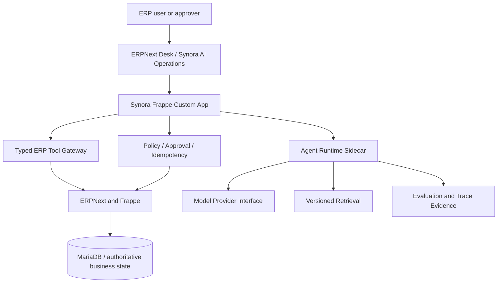
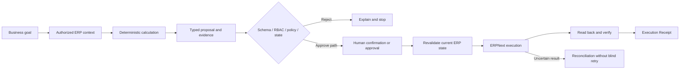
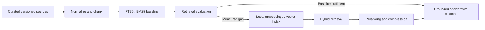

# Synora Agentic ERP

[English](README.md) | [简体中文](README.zh-CN.md)

> A governed Agentic Enterprise Operations product that turns ERP goals into explainable, authorized, verifiable business actions.

## Project status

Synora has completed **Phase 0 through Phase 3**: the governed engineering baseline, the pinned Frappe/ERPNext v16 pair, the typed read-only ERP Gateway (server-side Run/capability model, verified read tools, Agent Runtime HTTPX client), and the read-only procurement Agent (deterministic risk analysis, explainable plans, BYOK model provider, FTS5 retrieval, model-only explanation enhancement) are implemented and verified end-to-end over real HTTP.

Phase 3 exit review **passed**: the independent adversarial review initially returned `CHANGES_REQUIRED` with eight blocking findings; all eight are fixed and re-verified across three review rounds (final: PASS), including unified expiry/revocation/state/capability guards, optimistic-lock CAS with cancel-race protection and failure recovery, model enhancement wired into `plan_run` with persisted evidence and hard `max_tokens` budget, FTS5 permission-scope filtering, Runs pagination, XSS hardening, and Harness source tracking. Phase 4 startup remains a user decision. All write operations (Phase 4+) remain staged.

This status is an evidence boundary, not a reduction in product standards. Synora is being designed and developed as a production-grade enterprise product; this README does not present planned behavior as working software.

## Why Synora exists

Traditional ERP systems reliably enforce business rules and transactions, but users still need to understand modules, document relationships, operating sequences, permissions, and failure states. One procurement goal may require context from demand, inventory, open purchasing, suppliers, receiving, invoicing, and policy.

Synora changes the interaction model without replacing ERPNext:

> AI proposes. Deterministic software validates. Authorized humans control risk. ERPNext executes and records. Synora verifies and explains the result.

The initial domain is Procure-to-Pay: Material Request, Purchase Order, Purchase Receipt, Purchase Invoice, and Payment-related controls.

## Core capabilities

### Goal-driven procurement operations

Translate a natural-language procurement goal into authorized ERP context, deterministic shortage and duplicate checks, an explainable plan, and typed proposed actions.

### Governed business mutations

Apply schema validation, ERP permissions, policy, approval, current-state revalidation, idempotency, execution receipts, and reconciliation before treating any write as complete.

### Contextual ERP guidance

Explain blocked or failed ERP operations using the current document, user authorization, verified ERPNext knowledge, and company SOP sources while distinguishing facts, inferences, conflicts, and unknowns.

### Evaluation-driven AI evolution

Start with a single Agent, deterministic workflow control, and FTS5 retrieval. Add vector/hybrid retrieval or Multi-Agent roles only after controlled evaluation demonstrates a net benefit.

### Engineering evidence

Maintain requirements, architecture, decisions, tests, acceptance conditions, development logs, and reproducible benchmark evidence inside the repository.

## Target interaction

The following is an approved product scenario, not a claim that the runtime is already available.

**User goal**

```text
Check whether next week's deliveries will cause shortages. If so, prepare a procurement plan.
```

**Expected governed outcome**

```text
1. Read only the initiator's authorized demand, inventory, and open procurement.
2. Calculate shortages and duplicate-purchase risk deterministically.
3. Present evidence, unknowns, risks, and typed MR/PO Draft proposals.
4. Require explicit confirmation or the configured independent approval.
5. Revalidate ERP state before execution.
6. Read back the ERP document and produce an Execution Receipt.
7. Enter reconciliation instead of blindly retrying when the outcome is uncertain.
```

## Use cases

- **Procurement and operations users** identify shortages and prepare governed procurement actions without manually navigating every ERP module.
- **Approvers** review the business consequence, evidence, risk, and current ERP snapshot before authorizing high-risk actions.
- **ERP users** receive grounded explanations for permissions, document states, prerequisites, and validation failures.
- **Maintainers** evaluate Agent quality, safety, recovery, and system boundaries with traceable evidence.

## Getting started

### Review the current engineering baseline

Requirements: Git and Python 3.9+.

```bash
git clone https://github.com/atlax-tech/Synora-Agentic-ERP.git
cd Synora-Agentic-ERP
python3 .agents/skills/harness-build/scripts/validate_harness_structure.py .
```

Then read in this order:

1. [`AGENTS.md`](AGENTS.md) — project map and critical change boundaries.
2. [`docs/PRD.md`](docs/PRD.md) — authoritative product requirements.
3. [`docs/ARCHITECTURE.md`](docs/ARCHITECTURE.md) — system, trust, data, and technology boundaries.
4. [`docs/DESIGN.md`](docs/DESIGN.md) — frontend design constitution.
5. [`docs/ROADMAP.md`](docs/ROADMAP.md) — staged delivery and exit conditions.

### Product installation

The Frappe App and Agent Runtime scaffold and their verified commands are documented in `docs/DEVELOPMENT.md`. Product-level Agent capabilities and write operations are not yet installable; the Bench environment, pinned-baseline commands, deterministic seed data, and the Phase 2 real-HTTP verification (`env/dev/p26`) are runnable as described there.

## System architecture



| Component | Responsibility |
| --- | --- |
| ERPNext/Frappe | Permissions, business documents, validation, workflow, transactions, ledgers, final state |
| Synora Frappe App | Authenticated entry point, typed gateway, policy, approval, idempotency, execution, receipts |
| Agent Runtime | Intent, planning, constrained tool use, structured proposals, explanation, checkpoints, evaluation |
| Retrieval | Versioned sources, FTS5 baseline, citations, permission-aware context, later evidence-gated evolution |
| Harness and CI | Durable project knowledge, boundaries, verification roles, drift detection, acceptance evidence |

The Agent Runtime never connects directly to the ERP database and never becomes the final authorization boundary.

## Governed workflow



The controlled test baseline permits initiator confirmation for MR Draft and PO Draft. PO Submit, Receipt, Invoice, and Payment-related writes require an independent authorized approver. Stricter enterprise ERPNext Workflow rules always win.

## AI and retrieval strategy

### Initial Agent architecture

- One Agent with deterministic workflow and state-transition control.
- Allowlisted, typed, versioned ERP tools.
- Model output treated as untrusted input and parsed through versioned schemas.
- Model-provider abstraction; concrete models selected by evaluation.
- CI uses deterministic recorded or mock responses rather than a paid or nondeterministic model dependency.

### RAG evolution



Vector search, hybrid retrieval, reranking, and compression remain part of the complete learning and product architecture, but are adopted only when they outperform the FTS5 baseline on the same dataset.

### Multi-Agent boundary

The architecture preserves typed role, state, event, handoff, tool, policy, and audit contracts. Planner, Policy Reviewer, ERP Coach, or Reconciliation roles may be introduced when context isolation, independent review, permission separation, or bounded parallelism produces measured value. Free-form Agent swarms are excluded.

## Technology direction

| Layer | Target | Evidence status |
| --- | --- | --- |
| ERP | ERPNext v16, Frappe v16, MariaDB, Redis | Pinned in ADR-0002 (Frappe 16.31.0 / ERPNext 16.32.3) |
| ERP extension | Root-installable Frappe Custom App | Scaffolded and installed (P2.1) |
| Agent service | Python, FastAPI, Pydantic v2, HTTPX | Pinned in `services/agent_runtime` (FastAPI 0.141.1, HTTPX 0.28.1, Pydantic 2.12.5) |
| Workflow | Deterministic services; conditional LangGraph | Checkpoint/resume spike required (Phase 3) |
| Retrieval | SQLite FTS5/BM25 first | Vector/hybrid/reranking gated by evaluation |
| Frontend | ERPNext Desk using verified Frappe components | Product form approved; component baseline unresolved |
| Engineering | `uv`, Ruff, mypy, pytest | Verified (P2.1); commands in `docs/DEVELOPMENT.md` |
| Environment | Bench first, layered/custom `frappe_docker` later | Bench environment running (P1/P2) |

## Repository structure

```text
Synora-Agentic-ERP/
├── AGENTS.md                 # Agent knowledge map and critical boundaries
├── README.md                 # English project presentation
├── README.zh-CN.md           # Chinese project presentation
├── .agents/skills/           # Project-level engineering Skills
├── .harness/                 # Managed ownership, sources, unresolved items, fingerprints
└── docs/
    ├── PRD.md                # Product source of truth
    ├── ARCHITECTURE.md       # Architecture and technology boundaries
    ├── DESIGN.md             # Frontend design constitution
    ├── DEVELOPMENT.md        # Change and evidence protocol
    ├── TESTING.md            # Test strategy
    ├── ACCEPTANCE.md         # Product and release acceptance
    ├── ROADMAP.md            # Staged implementation plan
    ├── decisions/            # Architecture decision records
    └── development-log/      # Plain-language Chinese change history
```

## Safety design

- ERPNext remains the transactional system of record.
- Runtime-supplied identity is never trusted as authorization.
- Retrieved content, ERP fields, supplier data, and user text are untrusted.
- Business calculations, policy, permissions, state transitions, and write validation are deterministic.
- Every write is idempotent, revalidated, auditable, and verified against final ERP state.
- Ambiguous execution enters reconciliation instead of automatic retry.
- Secrets and unnecessary sensitive context are excluded from logs and model context.

## Testing and evidence

The target test system covers static architecture checks, unit tests, typed contract tests, real pinned ERP integration tests, scenario/E2E tests, Agent evaluations, failure injection, and security tests. Finite safety suites require 100% pass. Other thresholds are established from reproducible baselines rather than invented in advance.

Before a release or version update, an independent adversarial sub-agent must review the requirement, diff, tests, runtime evidence, architecture boundaries, data handling, and security failure modes.

## Roadmap

- [x] Phase 0: product definition, Harness Engineering, architecture, design, testing, and acceptance baseline
- [x] Phase 1: unmodified Frappe/ERPNext v16 baseline and P2P business archaeology
- [x] Phase 2: typed read-only ERP gateway
- [ ] Phase 3: read-only procurement Agent and FTS5 evaluation baseline
- [ ] Phase 4: proposals, approval, MR Draft, PO Draft, receipts, and reconciliation
- [ ] Phase 5: PO Submit, Receipt, Invoice, and Payment-related controlled operations
- [ ] Phase 6: contextual ERP Coach and full RAG evolution
- [ ] Phase 7: Multi-Agent evaluation and conditional adoption
- [ ] Phase 8: hardening, failure drills, benchmarks, and interview evidence

See [`docs/ROADMAP.md`](docs/ROADMAP.md) for milestone entry and exit conditions.

## Contributing

The governed read-only gateway is implemented; later phases remain staged. Before proposing a change, read `AGENTS.md` and the affected requirement, architecture, testing, and acceptance documents. Keep commits small, record the change in `docs/development-log/`, and report commands that actually ran.

## FAQ

### Is this a chatbot for ERPNext?

No. Natural language is an input surface; typed tools, deterministic services, ERP permissions, policy, approval, idempotency, and receipts govern actual business behavior.

### Why not start with Multi-Agent orchestration?

A single Agent provides a simpler evaluation baseline and avoids coordination risk. Multi-Agent roles are adopted only when they demonstrate measurable value without weakening governance.

### Why start retrieval with FTS5 instead of a vector database?

FTS5 is local, inspectable, inexpensive, and provides a clear baseline. The complete RAG roadmap remains intact, but added infrastructure must solve a measured retrieval problem.

### Can I run Synora today?

The Phase 2 read-only Gateway and Agent Runtime are runnable against the pinned Bench environment: see `docs/DEVELOPMENT.md` for verified commands and the `env/dev/p26` real-HTTP end-to-end verification. Product-level Agent planning (Phase 3) and all write operations (Phase 4+) are not yet available.

## License

Synora-authored repository content is licensed under the [MIT License](LICENSE). ERPNext/Frappe and vendored project Skills retain their own licenses; the final GPL, CC BY-NC, attribution, and distribution boundary remains an explicitly tracked architecture decision.
