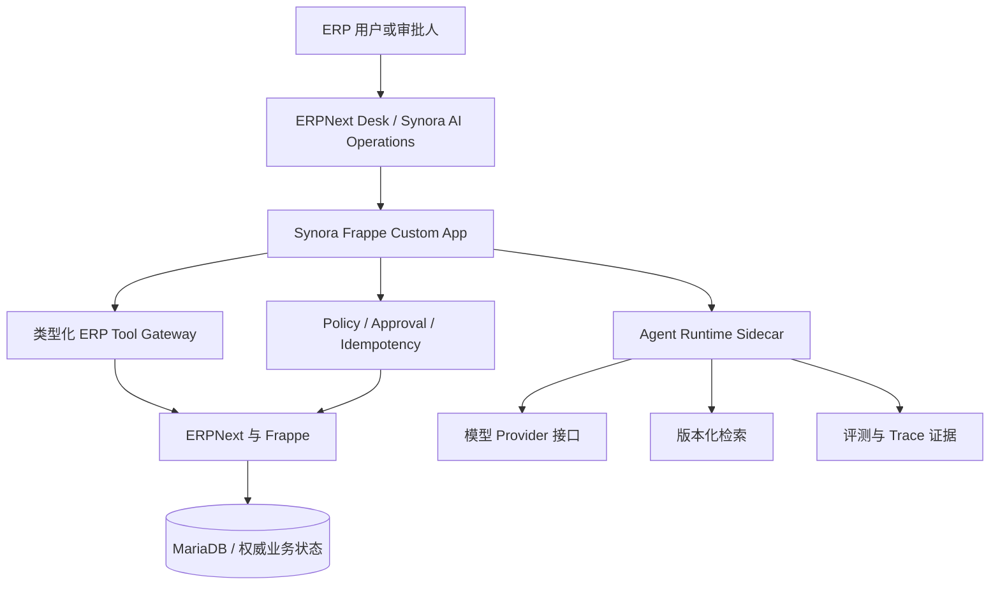
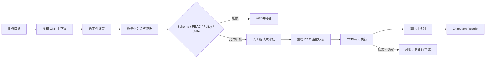
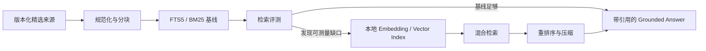

# Synora Agentic ERP

[English](README.md) | [简体中文](README.zh-CN.md)

> 将 ERP 业务目标转化为可解释、可授权、可验证企业行动的受治理 Agentic Operations 产品。

## 项目状态

Synora 已完成 **Phase 0 至 Phase 3 的只读范围**：经治理的工程基线、固定的 Frappe/ERPNext v16 组合、类型化只读 ERP Gateway（服务端 Run/capability 模型、已验证只读工具、Agent Runtime HTTPX 客户端），以及只读 Procurement Agent（确定性风险分析、可解释计划、BYOK 模型 Provider、FTS5 检索和失败安全的解释增强）均已实现。P3.5 的 Buyer → Frappe → Runtime → BYOK 链路已通过真实 HTTP 走通；模型输出不安全、超预算或无法验证时，会明确回退到确定性摘要。

Phase 3 阶段出口审查**已通过**：独立对抗审查最初返回 `CHANGES_REQUIRED`（8 项阻断），修复经过三轮复评；本轮最终收尾又关闭了 CAS 失败者误回滚、Docker sidecar 配置/认证、重定向、推理 token 成本记录和过时证据口径。模型护栏准确来说是“请求级输出预算 + Provider 用量校验”，不是服务商计费前的硬成本上限。Phase 4 尚未启动；`approval-workflow-mapping` 仍是启用写入前的明确门禁，全部写操作仍处于分阶段交付状态。

## 学习与阶段门禁

Synora 采用导师制 Agent 开发流程。每个阶段步骤开始前都会布置一个边界清晰的 Assignment，说明业务必要性、代码入口、预期输出、测试、不可修改边界、提示梯度和面试追问；安全可控的工作先由学习者尝试，安全门禁和生产缺陷仍由导师接管。

每个阶段结束时，先按 9 个 Agent 开发维度评分并登记 likelihood/impact 风险，再在最终 diff 和完整证据准备好后执行独立对抗审查。审查结果为 `CHANGES_REQUIRED` 或 `BLOCKED` 时阶段不能结束，只有最终 `PASS` 才能提交出口报告。用户的问题和卡点会在阶段日志中逐字记录，并紧跟导师解释与证据；每个阶段还会生成至少 5 道结合真实工作的项目与面试练习题。

这是证据边界，不是产品标准降级。Synora 始终按照生产级企业产品推进；本文不会把规划中的能力描述成已经可运行的软件。

## 为什么需要 Synora

传统 ERP 能可靠执行权限、校验和事务，但用户仍需理解模块、单据关系、操作顺序、权限与失败状态。一个采购目标往往需要同时查看需求、库存、在途采购、供应商、收货、发票和企业政策。

Synora 不替代 ERPNext，而是改变人与 ERP 的协作方式：

> AI 提议；确定性软件校验；有权人员控制风险；ERPNext 执行并记录；Synora 核对并解释结果。

首个业务域是完整 Procure-to-Pay：Material Request、Purchase Order、Purchase Receipt、Purchase Invoice 和 Payment 相关控制。

## 核心能力

### 目标驱动的采购操作

把自然语言采购目标转化为授权范围内的 ERP 上下文、确定性缺货与重复采购计算、可解释计划和类型化行动提议。

### 受治理的业务写入

在任何写操作完成前执行 Schema、ERP 权限、Policy、审批、实时状态重检、幂等、执行回执和对账。

### 上下文 ERP 指导

结合当前单据、用户权限、已验证的 ERPNext 知识和企业 SOP，解释操作被阻止或失败的原因，并明确区分事实、推断、冲突和未知。

### 评测驱动的 AI 演进

先建立单 Agent、确定性工作流和 FTS5 检索基线。只有评测证明净收益后，才引入向量/混合检索或 Multi-Agent 角色。

### 可复查的工程证据

把需求、架构、决策、测试、验收条件、开发日志和可复跑 Benchmark 证据长期保存在仓库中。

## 目标交互示例

以下是已经确认的产品场景，不代表当前运行时已经完成。

**用户目标**

```text
检查下周交付是否会造成缺货；如果会，准备采购方案。
```

**期望的受治理结果**

```text
1. 只读取发起人有权访问的需求、库存和在途采购。
2. 通过确定性代码计算缺货和重复采购风险。
3. 展示证据、未知项、风险和类型化 MR/PO Draft 提议。
4. 请求显式确认或已配置的独立审批。
5. 执行前重新校验 ERP 当前状态。
6. 读回 ERP 单据并生成 Execution Receipt。
7. 结果不确定时进入对账，禁止盲目重试。
```

## 应用场景

- **采购与运营人员**：减少跨模块查询和录入成本，形成受治理的采购行动。
- **审批人员**：在授权高风险写入前查看业务后果、证据、风险和 ERP 状态快照。
- **ERP 使用者**：获得有来源的权限、单据状态、前置条件和校验错误解释。
- **系统维护者**：通过可追踪证据评测 Agent 质量、安全、恢复能力和系统边界。

## 开始了解项目

### 查看当前工程基线

环境要求：Git、Python 3.9+。

```bash
git clone https://github.com/atlax-tech/Synora-Agentic-ERP.git
cd Synora-Agentic-ERP
python3 .agents/skills/harness-build/scripts/validate_harness_structure.py .
```

建议按以下顺序阅读：

1. [`AGENTS.md`](AGENTS.md)：项目知识地图和关键修改边界。
2. [`docs/PRD.md`](docs/PRD.md)：唯一产品需求事实源。
3. [`docs/ARCHITECTURE.md`](docs/ARCHITECTURE.md)：系统、信任、数据和技术边界。
4. [`docs/DESIGN.md`](docs/DESIGN.md)：前端设计宪章。
5. [`docs/ROADMAP.md`](docs/ROADMAP.md)：分阶段交付与退出条件。

### 产品安装状态

Frappe App 与 Agent Runtime 的工程脚手架及已验证命令见 `docs/DEVELOPMENT.md`。产品级 Agent 能力与写操作尚不可安装；Bench 环境、固定基线命令、确定性种子数据与 Phase 2 真实 HTTP 验证（`env/dev/p26`）可按该文档实际运行。

## 系统架构



| 组件 | 职责 |
| --- | --- |
| ERPNext/Frappe | 权限、业务单据、校验、Workflow、事务、账务和最终状态 |
| Synora Frappe App | 登录入口、类型化网关、Policy、审批、幂等、执行和回执 |
| Agent Runtime | 意图、规划、受限工具调用、结构化提议、解释、Checkpoint 和评测 |
| Retrieval | 版本化来源、FTS5 基线、引用、权限过滤和后续证据驱动演进 |
| Harness 与 CI | 项目知识、修改边界、独立验证角色、漂移检查和验收证据 |

Agent Runtime 不直连 ERP 数据库，也不成为最终授权边界。

## 受治理的核心流程



测试基线允许 MR Draft 和 PO Draft 由发起人显式确认。PO Submit、Receipt、Invoice 和 Payment 相关写操作必须由独立的有权审批人授权；企业 ERPNext Workflow 更严格时始终以更严格规则为准。

## AI 与检索方案

### 第一阶段 Agent 架构

- 单 Agent + 确定性工作流和状态转换。
- Allowlist 中的类型化、版本化 ERP 工具。
- 模型输出一律视为不可信输入，必须经过版本化 Schema 解析。
- 通过 Provider 接口隔离具体模型，模型选择由评测决定。
- CI 使用确定性的 Mock/Recorded Responses，不依赖付费或非确定性模型。

### RAG 演进



向量检索、混合检索、Rerank 和 Context Compression 都保留在完整学习与产品架构中，但必须在同一评测集上证明优于 FTS5 基线后才能采用。

### Multi-Agent 边界

架构预留类型化 Role、State、Event、Handoff、Tool、Policy 和 Audit 契约。只有当上下文隔离、独立审查、权限分离或有界并行带来可测量收益时，才考虑 Planner、Policy Reviewer、ERP Coach 或 Reconciliation Agent；禁止自由聊天式 Agent Swarm。

## 技术方向

| 层级 | 目标技术 | 证据状态 |
| --- | --- | --- |
| ERP | ERPNext v16、Frappe v16、MariaDB、Redis | ADR-0002 已固定（Frappe 16.31.0 / ERPNext 16.32.3） |
| ERP 扩展 | 根目录可安装的 Frappe Custom App | P2.1 已创建脚手架并安装 |
| Agent 服务 | Python、FastAPI、Pydantic v2、HTTPX | `services/agent_runtime` 已固定（FastAPI 0.141.1、HTTPX 0.28.1、Pydantic 2.12.5） |
| Workflow | 确定性服务；条件式 LangGraph | Phase 3 Spike 已关闭；只有 Phase 4 写入恢复有实测需要时才重估 |
| Retrieval | SQLite FTS5/BM25 优先 | Vector/Hybrid/Rerank 由评测门禁控制 |
| 前端 | ERPNext Desk 与已验证的 Frappe 组件 | 产品形态已确认；组件基线待验证 |
| 工程工具 | `uv`、Ruff、mypy、pytest | P2.1 已验证；命令见 `docs/DEVELOPMENT.md` |
| 开发环境 | Bench 优先，后续 custom/layered `frappe_docker` | Bench 环境已运行（P1/P2） |

## 项目结构

```text
Synora-Agentic-ERP/
├── AGENTS.md                 # Agent 知识地图与关键边界
├── README.md                 # 英文项目说明
├── README.zh-CN.md           # 中文项目说明
├── .agents/skills/           # 项目级工程 Skills
├── .harness/                 # 所有权、来源、未决项与指纹
└── docs/
    ├── PRD.md                # 产品需求事实源
    ├── ARCHITECTURE.md       # 架构与技术边界
    ├── DESIGN.md             # 前端设计宪章
    ├── DEVELOPMENT.md        # 修改与证据协议
    ├── TESTING.md            # 测试策略
    ├── ACCEPTANCE.md         # 产品与发布验收
    ├── ROADMAP.md            # 分阶段实现计划
    ├── decisions/            # 架构决策记录
    └── development-log/      # 通俗中文开发历史
```

## 安全设计

- ERPNext 始终是事务型业务事实源。
- 不信任 Runtime 自报身份，不绕过 ERP 权限与 Workflow。
- 检索内容、ERP 字段、供应商数据和用户输入全部视为不可信。
- 业务计算、Policy、权限、状态转换和写入校验由确定性软件执行。
- 每次写入都必须幂等、实时重检、可审计并核对 ERP 最终状态。
- 结果不确定时进入对账，禁止自动盲重试。
- Secrets 和非必要敏感上下文不得进入日志或模型上下文。

## 测试与证据

目标测试体系包括静态架构检查、单元测试、类型化契约测试、真实固定版本 ERP 集成测试、场景/E2E、Agent Eval、故障注入和安全测试。有限安全测试集必须 100% 通过；其他阈值由可复跑基线产生，不能提前捏造。

每次发布或版本更新前，必须由独立对抗性 sub-agent 检查原始需求、Diff、测试、运行证据、架构边界、数据处理和安全失败路径。

## Roadmap

- [x] Phase 0：产品定义、Harness Engineering、架构、设计、测试和验收基线
- [x] Phase 1：未修改的 Frappe/ERPNext v16 基线与 P2P 业务考古
- [x] Phase 2：类型化只读 ERP Gateway
- [x] Phase 3：只读 Procurement Agent 与 FTS5 评测基线
- [ ] Phase 4：Proposal、审批、MR Draft、PO Draft、Receipt 与对账
- [ ] Phase 5：PO Submit、Receipt、Invoice 和 Payment 相关受控流程
- [ ] Phase 6：Contextual ERP Coach 与完整 RAG 演进
- [ ] Phase 7：Multi-Agent 评测与条件式采用
- [ ] Phase 8：工程强化、故障演练、Benchmark 与面试证据

各阶段进入和退出条件见 [`docs/ROADMAP.md`](docs/ROADMAP.md)。

## 参与贡献

受治理的只读 Gateway 与 Phase 3 Procurement Agent 已实现；后续阶段仍处于分阶段交付状态。修改前请先阅读 `AGENTS.md` 及相关需求、架构、测试和验收文档；遵循 Assignment/导师流程，保持小步提交，在 `docs/development-log/` 中记录通俗中文说明、用户原话问题，并如实报告实际运行的命令。

## 常见问题

### 这是一个 ERPNext 聊天机器人吗？

不是。自然语言只是输入界面；实际业务行为受类型化工具、确定性服务、ERP 权限、Policy、审批、幂等和回执控制。

### 为什么不一开始就使用 Multi-Agent？

单 Agent 能形成更清晰的评测基线并减少协作风险。只有 Multi-Agent 带来可测量净收益且不削弱治理边界时才会采用。

### 为什么先使用 FTS5，而不是直接使用向量数据库？

FTS5 本地、可检查、成本低，适合作为明确基线。完整 RAG 路线不会删除，但新增基础设施必须解决已经测量的问题。

### 现在能运行 Synora 吗？

Phase 3 只读 Gateway 与采购 Agent 可基于固定 Bench 环境运行：命令见 `docs/DEVELOPMENT.md`，真实 HTTP 检查见 `env/dev/p26` 与 `env/dev/p35`。Phase 4 的 Proposal、审批和 ERP 写入尚不可用；启用写入前必须先解决 `approval-workflow-mapping`。

## License

Synora 自有仓库内容采用 [MIT License](LICENSE)。ERPNext/Frappe 和项目内安装的 Skills 保留各自许可证；GPL、CC BY-NC、归属声明和分发边界仍是显式跟踪的架构决策。
