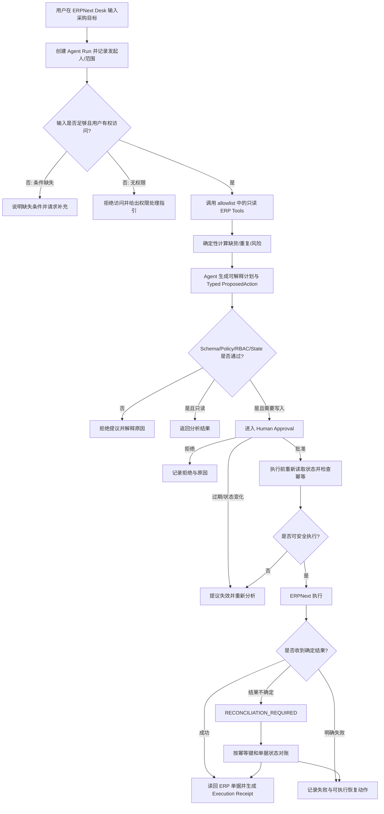

# Synora Agentic ERP 产品需求文档

文档状态：产品定义与落地需求 v1 已带条件批准。本文是项目唯一的产品需求事实源；标有 `[待确认]` 的细节不得由 Coding Agent 自由补全。

## 1. 产品概述

### 1.1 一句话定位

Synora 是面向采购、运营和 ERP 审批人员的企业级 Agentic Operations 产品：用户用自然语言描述业务目标，系统在 ERPNext 真实业务上下文中完成受权限约束的分析、规划、审批、执行、核对和审计。

与传统 ERP 菜单/表单操作相比，Synora 的差异不是替代 ERPNext，而是把“用户理解目标并手工跨模块操作”转变为“AI 理解和规划、确定性软件治理、人审批高风险动作、ERP 执行并留痕”。

核心业务任务是：结合近期需求、库存、未结采购、供应商与策略约束识别采购风险，形成可解释的行动计划，经治理和审批后创建 ERPNext 业务动作，并以读回核对和执行回执证明 ERP 已到达预期状态。

### 1.2 产品形态

- **当前形态**：ERPNext Desk 内的 Synora AI Operations 页面与审批入口。
- **选择理由**：采购用户的主数据、权限、单据和工作上下文已经存在于 ERPNext；在宿主系统内提供入口可以复用登录态、角色、单据跳转和操作习惯，避免重建 ERP UI。
- **阶段策略**：第一阶段只实现桌面 Web 端；独立门户、移动端和外部聊天入口均不在当前范围。

### 1.3 产品原则

> AI 提议；确定性软件校验；人授权高风险动作；ERPNext 执行与记录；Synora 核对并解释结果。

任何模型输出、检索文本、ERP 字段或用户输入都不能直接成为业务写入指令。

### 1.4 产品目标

- 降低用户理解 ERP 模块、单据关系和操作顺序的成本。
- 降低跨 Sales、Inventory、Purchase、Receiving 和 Accounting 获取上下文的操作成本。
- 将模糊业务目标转换为可解释、可审查、可追踪的结构化采购行动。
- 在不破坏 ERP 权限、校验、事务和审计的前提下开放受控自动化。
- 建立能覆盖正常、异常、失败恢复和安全攻击的 Agent 评测体系。
- 形成可追溯、可复跑、可用于技术面试深入讲解的工程证据。

### 1.5 商业与项目价值

- **用户价值**：减少查找模块、切换页面、理解错误和重复录入的负担。
- **企业价值**：在保留现有 ERP 投资与控制机制的前提下，提高流程可达性、可解释性和受控自动化程度。
- **项目价值**：展示 AI Agent 与企业软件在领域建模、工具调用、权限、审批、幂等、故障恢复、RAG、评测和可观测性上的完整结合。
- **量化边界**：当前没有真实企业采用或效率数据。后续只能使用可复跑 benchmark 产生的指标，不得提前填写百分比。

### 1.6 非目标

- 不构建通用 ERP 聊天机器人或一组浅层领域 Agent。
- 不让 LLM 重新实现 ERPNext 的库存、会计、权限或事务规则。
- 不允许模型生成 SQL、访问任意 URL、调用未注册工具或直连 ERP 数据库。
- 不修改 Frappe/ERPNext 上游核心，不重建整套 ERP 用户界面。
- 不在缺少可复跑证据时声称生产采用、效率提升或企业级成果数据。

## 2. 目标用户与使用场景

### 2.1 用户画像

| 用户 | 特征与目标 | 主要痛点 | 关键权限 |
| --- | --- | --- | --- |
| 采购/运营用户 | 知道交付或补货目标，需要形成采购方案 | 不熟悉跨模块路径；查询和录入重复；错误难理解 | 查看授权业务数据、发起 Agent Run、创建草稿提议 |
| 采购负责人/审批人 | 对金额、供应商、数量和风险负责 | 需要快速理解提议依据和影响；担心 AI 越权或重复执行 | 查看完整提议、批准/拒绝/要求修改、高风险写入授权 |
| ERP 使用者 | 正在处理 MR、PO、Receipt 或 Invoice | 不理解状态、权限、前置单据或配置错误 | 查看自己有权访问的单据与上下文帮助 |
| 系统维护者 | 维护模型、工具、策略、评测和审计 | 难以定位模型、工具、ERP 或网络层故障 | 配置工具与策略、查看脱敏运行证据、执行评测 |

具体 ERPNext Role 名称与权限矩阵必须在 ERP baseline 后确认，不能由实现 Agent 自行命名。

### 2.2 典型场景

#### SC-001 采购风险分析与草稿准备

采购用户提出：“检查下周交付需求是否会造成缺货；如果有，准备采购方案。”系统读取其有权访问的库存、需求和在途采购，确定性计算风险，解释结论，生成 MR/PO Draft 提议并请求所需审批。

#### SC-002 高风险动作审批与执行

审批人查看提议中的业务目标、来源、计算、供应商、数量、金额、重复风险和状态快照。审批后系统重新检查 ERP 当前状态，通过后才执行；状态已变化时提议过期并要求重新分析。

#### SC-003 ERP 操作失败解释

用户在 PO、Receipt 或 Invoice 流程遇到错误。Synora 结合当前单据、角色、ERP 错误、已验证 ERPNext 知识和模拟 SOP，解释原因、证据和下一步；证据不足时明确说明未知。

#### SC-004 执行结果不确定时对账

ERP 请求超时，但写入可能已经成功。Synora 不直接重试，而是通过 idempotency key、目标单据和关键字段查询结果，确认成功、失败或需要人工处理。

## 3. 核心用户动线



## 4. 功能清单与阶段优先级

```text
Synora Agentic ERP
├── 🔴 F-001 Agent Run 与目标输入
├── 🔴 F-002 授权上下文获取与 Typed ERP Tools
├── 🔴 F-003 确定性采购风险分析
├── 🔴 F-004 可解释计划与 ProposedAction
├── 🔴 F-005 Policy / RBAC / Approval 治理
├── 🔴 F-006 MR Draft / PO Draft 受控执行
├── 🔴 F-007 Execution Receipt / Idempotency / Reconciliation
├── 🔴 F-008 Audit / Trace / Failure Evidence
├── 🟡 F-009 PO Submit 受控执行
├── 🟡 F-010 Purchase Receipt 受控流程
├── 🟡 F-011 Purchase Invoice 受控流程
├── 🟡 F-012 Payment 相关受控流程
├── 🟡 F-013 Contextual ERP Coach
├── 🟡 F-014 完整 RAG 演进：Vector / Hybrid / Rerank
└── ⚪ F-015 条件式 Multi-Agent 角色拆分
```

F-009 至 F-012 是完整 P2P 需求的一部分，只是分阶段实现，不得从 Roadmap 或 SPEC 中删除。

## 4.1 关键页面线框图

```text
┌──────────────────────────────────────────────────────────────────────────────┐
│ ERPNext 顶部导航                    Synora AI Operations       用户 / 通知    │
├───────────────┬──────────────────────────────────────────────────────────────┤
│ ERPNext       │  采购目标                                                   │
│ 模块导航      │  ┌────────────────────────────────────────────────────────┐ │
│               │  │ 描述目标、时间范围、公司/仓库范围                     │ │
│ Buying        │  └────────────────────────────────────────────────────────┘ │
│ Stock         │  [开始分析]                                                 │
│ Accounting    ├──────────────────────────────────────────────────────────────┤
│               │  Run 状态与进度                                             │
│ Synora        │  Goal → Context → Analysis → Proposal → Approval → Receipt  │
│ · New Run     ├───────────────────────────────┬──────────────────────────────┤
│ · Runs        │  分析与计划（视觉重心）       │  证据 / 风险 / 状态快照      │
│ · Approvals   │  - 缺货 SKU                  │  - ERP 来源                   │
│ · Audit       │  - 确定性计算                │  - 权限结果                   │
│               │  - Agent 解释                 │  - Policy 结果                │
│               │  - Proposed Actions           │  - 未知与警告                  │
│               ├───────────────────────────────┴──────────────────────────────┤
│               │  [拒绝] [要求修改] [批准并执行]    高风险动作后果说明        │
└───────────────┴──────────────────────────────────────────────────────────────┘
```

## 5. 核心功能详细需求

### 5.1 F-001 Agent Run 与目标输入

**功能描述**：在 ERPNext Desk 创建一次有身份、范围、状态和审计关联的 Agent Run。

**触发条件**：已登录用户打开 Synora AI Operations，并拥有使用 Synora 的权限。

**交互处理**：

| 场景 | 处理方式 |
| --- | --- |
| 默认 | 显示目标输入、可访问的公司/仓库范围和最近 Runs |
| 提交中 | 禁止重复提交，显示正在创建 Run |
| 条件不足 | 指出缺少的时间范围、业务目标或范围，不自动猜测 |
| 无权限 | 禁用开始按钮并说明需要的授权处理方向，不泄露不可访问数据 |
| 创建成功 | 跳转 Run 详情并显示可取消的分析状态 |
| 请求失败 | 保留用户输入，显示可重试错误与 correlation id |

**边界条件**：空目标、超长输入、重复点击、失效会话、无可访问公司、网络超时、恶意指令和敏感信息都必须有明确处理。

**数据规范**：

| 字段 | 类型 | 必填 | 约束 |
| --- | --- | --- | --- |
| run_id | UUID/ULID | 是 | 服务端生成，全局唯一 |
| goal | string | 是 | 长度上限 `[待确认]`；保存原始文本但不得作为直接写指令 |
| initiator | Frappe User reference | 是 | 从登录态记录，不接受 Runtime 参数覆盖 |
| company_scope | reference/list | 是 | 只能选择用户有权访问的公司 |
| warehouse_scope | reference/list | 否 | 为空时的默认规则 `[待确认]` |
| time_window | structured duration/date range | 否 | 缺省行为必须在 SPEC 中确认 |
| status | enum | 是 | 只能由确定性状态机转换 |
| created_at | timestamp | 是 | 服务端时间 |

### 5.2 F-002 授权上下文与 Typed ERP Tools

**功能描述**：Runtime 只能调用注册表中经过版本化、类型化和风险分类的业务工具，获取发起人有权访问的 ERP 上下文。

**首批工具方向**：projected stock、open demand、open Material Requests、open Purchase Orders、Item/Supplier lookup。

**交互与失败**：工具执行时显示当前步骤；部分工具失败时不得把缺失数据当作 0；权限拒绝、数据不存在、ERP 校验错误、超时和限流必须返回不同错误类型。

**边界条件**：大结果集分页、跨公司访问、禁用供应商、停用物料、已取消单据、字段缺失、ERP 版本差异、重复 tool call。

**工具契约最小字段**：tool name/version、run_id、typed input、authorized scope、risk、timeout、result/error envelope、source snapshot、correlation id。

### 5.3 F-003 确定性采购风险分析

**功能描述**：根据 ERPNext 授权数据和明确配置计算缺货、已有供应和重复采购风险。库存公式、数量、金额、日期比较和阈值判断必须由确定性代码或 ERPNext 完成。

**状态**：等待数据、计算中、计算完成、输入不足、数据冲突、计算失败。

**边界条件**：多个仓库/UOM、负库存、部分交付、在途 PO、已有 MR、过期供应商报价、缺少 lead time、并发业务状态变化。

**验收重点**：同一固定输入必须得到同一结果；无法取得必需输入时返回 UNKNOWN/NEEDS_INPUT，不得由 LLM 估算。

### 5.4 F-004 可解释计划与 ProposedAction

**功能描述**：Agent 将目标和确定性分析转换为用户可审查的计划，并通过 versioned typed schema 提出一个或多个行动。

**必须展示**：目标、数据来源、关键计算、建议动作、供应商/物料/数量/金额、业务理由、风险、未知项、状态快照和审批要求。

**状态**：生成中、可审查、schema invalid、policy rejected、需要补充、已过期。

**边界条件**：模型输出未知 action、缺字段、无效枚举、超出范围、引用不存在对象、一次生成相互冲突的动作、计划与 payload 不一致。

**验收重点**：自然语言说明不能覆盖 typed payload；schema 不通过时不得进入审批。

### 5.5 F-005 Policy / RBAC / Approval

**功能描述**：对 ProposedAction 执行权限、业务政策、风险和当前状态检查；需要审批的动作必须由有权用户显式决定。

**审批页面必须显示**：动作和后果、审批人权限、计算和来源、差异/风险、状态快照时间、过期条件、批准/拒绝/要求修改入口。

**状态**：awaiting、approved、declined、changes_requested、expired、revoked。

**边界条件**：审批人无权、自己审批是否允许 `[待确认]`、多审批人策略 `[待确认]`、审批后权限撤销、审批后数据变化、重复审批、并发审批。

**危险操作确认文案原则**：说明将创建/提交的真实 ERP 单据、关键金额和影响，并提示执行前还会重新校验；不得只显示“确认”。

### 5.6 F-006 MR Draft / PO Draft 受控执行

**功能描述**：仅在 action、policy、approval 和实时状态全部有效时，通过 Frappe/ERPNext 创建目标草稿。

**执行规则**：

- Runtime 不持有任意 ERP 写权限。
- 写入由 Frappe 网关在已验证用户/审批上下文中执行。
- 使用稳定 idempotency key 防止重复创建。
- 不绕过 ERPNext controller、permission、workflow 或 validation。
- 执行后读回单据并核对关键字段。

**边界条件**：目标对象已存在、供应商/物料被禁用、数量或金额变化、审批过期、ERP ValidationError、网络断开、执行超时、部分批量成功。

### 5.7 F-007 Receipt、幂等与对账

**功能描述**：每次执行都生成结构化 Receipt；无法确定结果时进入对账状态而不是自动重试。

**Receipt 最小信息**：run/action/idempotency ids、actor/approver、target DocType/name、requested payload digest、verified fields、ERP response category、timestamps、final status、correlation ids。

**状态**：succeeded、failed、reconciliation_required、reconciled_success、reconciled_failure、manual_intervention。

**验收重点**：相同 idempotency key 不产生第二份业务单据；ERP 成功但响应丢失时能够找到原单据。

### 5.8 F-008 Audit / Trace / Failure Evidence

**功能描述**：以 run_id 贯通目标、上下文、模型决策摘要、工具、policy、审批、ERP 写入、receipt 和恢复过程。

**安全边界**：API secrets、完整凭证、未脱敏敏感数据和不必要的模型原始上下文不得进入日志。

**交互**：支持按 run/status/date/actor/action 搜索；空状态说明尚无运行；权限不足时不展示审计详情；长 trace 分段加载。

### 5.9 F-013 Contextual ERP Coach

**阶段**：完整 P2P 写闭环后的重要能力。

**功能描述**：基于当前 ERP 页面、单据、角色、错误、已验证 ERPNext 知识和模拟 SOP 提供来源可追踪的解释。

**状态与边界**：检索中、有依据回答、来源冲突、无可靠来源、无权读取、恶意内容被隔离。无依据时必须拒绝编造。

### 5.10 F-014 完整 RAG 演进

**首版实现**：curated source、版本 metadata、chunk、SQLite FTS5/BM25、来源引用、检索评测。

**完整方案保留**：local embedding、vector index、hybrid retrieval、reranking、context compression、permission filtering、增量更新和索引重建。

**引入条件**：必须在同一评测集上证明相对于 FTS5 baseline 的召回、排序或 groundedness 收益，并记录延迟和资源代价。

### 5.11 F-015 条件式 Multi-Agent

**首版实现**：单 Agent + deterministic workflow。

**预留角色**：Procurement Planner、Policy/Compliance Reviewer、ERP Coach、Reconciliation Agent。

**引入条件**：上下文隔离、独立审查、权限分离或并行收益至少一项被评测证明。

**风险控制**：共享 typed state、显式 handoff schema、统一 gateway/policy/audit、角色工具 allowlist、最大步数、超时、loop detection、完整 trace，并与单 Agent baseline A/B 对比。

## 6. 状态模型

### 6.1 Agent Run

| 状态 | 含义 | 可执行动作 |
| --- | --- | --- |
| CREATED | Run 已建立 | 开始分析、取消 |
| ANALYZING | 正在获取上下文和计算 | 查看进度、取消 |
| PROPOSED | 已生成可审查提议 | 查看、提交审批 |
| AWAITING_APPROVAL | 等待授权 | 批准、拒绝、要求修改 |
| EXECUTING | 已批准并执行 | 只读查看，禁止重复触发 |
| SUCCEEDED | ERP 状态已核对 | 查看 Receipt/单据 |
| FAILED | 明确失败 | 查看原因、按允许方式重试 |
| RECONCILIATION_REQUIRED | 结果不确定 | 启动/查看对账，禁止盲重试 |
| CANCELLED | 用户或系统取消 | 查看历史 |

### 6.2 ProposedAction

| 状态 | 含义 |
| --- | --- |
| DRAFT | Agent 正在构造 |
| INVALID | Schema 或基本约束不通过 |
| POLICY_REJECTED | 确定性政策拒绝 |
| AWAITING_APPROVAL | 等待审批 |
| APPROVED | 已批准但尚未执行 |
| DECLINED | 审批拒绝 |
| EXPIRED | 状态快照、权限或时效已失效 |
| EXECUTED | 已执行且有 Receipt |

## 7. 文案规范

### 7.1 风格

整体采用“专业严谨、简洁直接”的企业软件文案。系统必须明确区分事实、建议、风险和未知，不使用拟人化语气掩盖不确定性。

### 7.2 终端用户文案原则

| 场景 | 要求 | 示例方向 |
| --- | --- | --- |
| 开始按钮 | 动词开头，说明动作 | “开始分析采购风险” |
| 加载 | 说明当前步骤 | “正在读取授权范围内的在途采购…” |
| 空状态 | 解释原因并给下一步 | “尚无采购分析。输入交付或补货目标开始。” |
| 权限错误 | 不泄露数据，给处理方向 | “你没有读取该公司采购数据的权限，请联系 ERP 管理员。” |
| 失败 | 原因 + 下一步 + correlation id | “ERPNext 未确认执行结果，系统已停止重试并进入对账。” |
| 审批 | 明确真实后果 | “批准后将创建 1 份 Purchase Order Draft；执行前会重新校验库存和在途订单。” |
| 未知 | 明确证据不足 | “当前证据不足，无法确认该单据为何被阻止。” |

最终中英文 UI 术语表 `[待确认]`，不能在实现中随意混用同义词。

## 8. 非功能性需求

### 8.1 安全与权限

- 全部 ERP 数据访问继承或显式复核 Frappe/ERPNext 权限。
- Runtime 不直连 ERP 数据库，不持有任意写凭证。
- 工具 allowlist、typed schema、risk classification 和 policy 是强制门禁。
- Retrieved content 与 ERP/user text 视为不可信数据，不能修改系统指令或授权。
- Secrets 不进入代码、日志、模型上下文、审计详情或 Git。
- 所有高风险写入必须可追溯到发起人和审批人。

### 8.2 一致性与可靠性

- 写操作必须幂等，并处理执行成功但响应丢失。
- 审批与执行之间必须进行状态和权限重检。
- 状态机必须拒绝非法转换和重复操作。
- 外部模型不可用时安全失败，不影响 ERPNext 原有操作能力。

### 8.3 可测试性

- CI 不依赖付费或非确定性模型。
- 单元、契约、真实 ERP 集成、E2E、Agent Eval、故障和安全测试均有独立层。
- 有限安全场景必须 100% 通过；其他阈值在 baseline 后确定。

### 8.4 可观测性与审计

- run_id、action_id、tool_call_id、idempotency_key 和 receipt_id 可关联。
- 失败分类能区分输入、权限、policy、ERP、模型、网络、超时和结果不确定。
- 日志和审计采用最小必要数据与脱敏策略。

### 8.5 性能与容量

- 目标响应时间、并发数、数据保留时间和容量上限：`[待确认：需在 ERP baseline 与本地模型 benchmark 后制定]`。
- 在指标确认前，实现不得编造 `<2s`、`500ms` 或生产并发承诺。

### 8.6 兼容性

- 首阶段支持 ERPNext/Frappe v16 的固定 commit pair。
- 浏览器和操作系统支持矩阵：`[待确认：以固定 Frappe v16 官方支持范围与实际验证为准]`。
- 移动端和离线模式不在当前范围。

### 8.7 可维护性

- ERP 行为结论必须指向固定版本源码、官方测试或运行证据。
- 每次变更记录开发日志并采用小步提交。
- 发布/版本更新前执行独立对抗性 sub-agent 验证。
- Approved requirements 只能 staged，不得为降低复杂度而删除。

## 9. 测试与验收摘要

### 9.1 第一受控写入验收

- 用户目标能够形成结构化、可解释的 MR Draft 或 PO Draft 提议。
- 无权限、非法、过期、重复或状态冲突的提议全部 fail closed。
- 需要审批的动作无法绕过审批执行。
- 执行前重检权限和 ERP 状态。
- 成功写入后读回目标单据并生成 Receipt。
- 相同幂等键不产生重复单据。
- 结果不确定时进入对账而不是直接重试。

### 9.2 RAG 验收

- 回答带版本化来源；无来源时拒绝或标为未知。
- 检索遵守权限和版本范围。
- Prompt Injection 不能改变工具、policy 或授权。
- 向量/混合检索必须相对 FTS5 baseline 有测量收益。

### 9.3 Multi-Agent 验收

- 与单 Agent baseline 使用同一数据集比较质量、延迟、成本、安全、trace 完整性和复杂度。
- 未产生净收益或破坏治理边界时不采用。

## 10. 成功指标与 Benchmark 计划

- End-to-end task success。
- Tool selection 与参数有效率。
- Grounded claim / citation coverage。
- Unauthorized mutation count。
- Duplicate transaction count。
- Reconciliation success。
- 人工流程与 Agent 流程的页面跳转、用户输入、审批次数和完成时间。

当前只定义测量方法，不填写结果。所有公开数字必须能由固定版本、固定数据和固定步骤复跑。

## 11. 依赖与风险

### 11.1 外部依赖

- 固定版本 Frappe v16 / ERPNext v16 / MariaDB / Redis。
- 本地或 OpenAI-compatible 模型 Provider。
- Agent Workflow、typed schema、HTTP client 和检索组件，具体版本由技术 Spike 和依赖锁定决定。

### 11.2 主要风险

- 项目退化为聊天机器人或浅层功能集合。
- 模型复制 ERP 规则或绕过权限。
- Identity/RBAC、TOCTOU、重复写和结果不确定处理错误。
- Prompt Injection、敏感信息和审计数据泄露。
- Frappe/ERPNext 版本漂移。
- Multi-Agent 或向量基础设施为展示技术而过度建设。
- Vibe Coding 导致实现者无法解释数据流、边界和失败模式。
- 第三方许可证、商标和 README 声明边界不清。

对应控制措施见 `docs/ARCHITECTURE.md`、`docs/TESTING.md` 和 `docs/ACCEPTANCE.md`。

## 12. 待确认问题

- [ ] Frappe v16 与 ERPNext v16 的完整 baseline commit pair。
- [ ] Frappe 与 Runtime 之间的用户绑定授权方案。
- [ ] 具体 ERPNext Role/Permission Matrix 与“发起人能否审批自己的动作”。
- [ ] 多级审批、金额阈值和策略配置来源。
- [ ] Goal 长度、默认公司/仓库/时间范围。
- [ ] 性能、并发、数据保留和浏览器支持指标。
- [ ] 本地模型和可选 Provider 的 eval baseline。
- [ ] LangGraph checkpoint 与恢复 Spike 结果。
- [ ] RAG 向量化和 Multi-Agent 的量化准入阈值。
- [ ] MIT、ERPNext GPL-3.0、Harness Armor CC BY-NC 的发布与 NOTICE 边界。

这些问题不阻塞 Harness 和前置文档建设，但相关实现开始前必须逐项解决或明确进入哪个里程碑解决。

## 13. 需求来源

- `.synora-product-architecture-review.tmp.md` — 2026-08-24 带条件审核通过的产品与架构评审。
- Harness 初始化阶段的 Product 定义 — 其使命、用户、核心任务、能力、非目标和完整 P2P 边界已合并入本文。
- `docs/ARCHITECTURE.md` — 组件、信任边界、Multi-Agent 与 RAG 演进约束。
- `docs/ACCEPTANCE.md` — 产品和发布验收原则。
