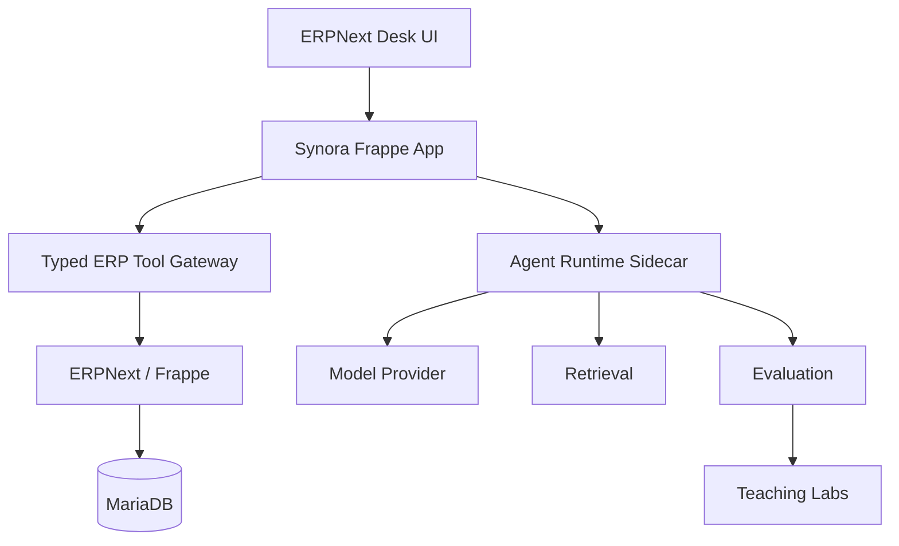
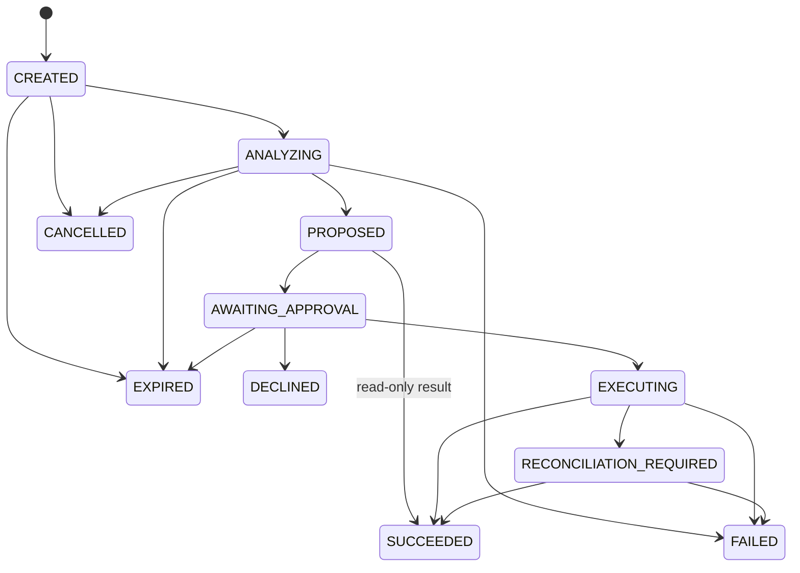

# Synora Agentic ERP Engineering Specification

Status: `CONFIRMED` product and architecture constraints. Phase 0–3 implementation exists; Phase 4–13 contracts remain planned until each phase produces exit evidence.

## 1. Authority and Change Rules

This specification translates approved requirements into implementable boundaries, contracts, state machines, and verification obligations.

Authority order:

1. `docs/PRD.md` defines product scope, users, priority, and acceptance intent.
2. `docs/ARCHITECTURE.md` defines system, trust, data ownership, dependency, approval, and technology boundaries.
3. `docs/DESIGN.md` defines frontend interaction and visual design obligations.
4. This file defines cross-component engineering contracts and requirement traceability.
5. ADRs record later implementation decisions supported by Spike or runtime evidence.

An implementation may stage a requirement but may not delete, demote, or silently weaken it. Any conflict between these authorities is `CONFLICTED` and blocks implementation until resolved.

## 2. Product Scope and Delivery Boundary

The repository serves two approved purposes in one codebase and one development line: the business application layer proves governed Procure-to-Pay behavior against real ERPNext, while the teaching lab implements runnable Agent-pattern comparisons and adoption/rejection evidence. A lab is never evidence that business behavior is deployed.

The complete ERP business scope covers governed Procure-to-Pay operations:

```text
Material Request
  -> Purchase Order
  -> Purchase Receipt
  -> Purchase Invoice
  -> Payment-related status and controlled operations
```

Phase 4 builds the bounded Agent execution kernel without writes. Phase 5 adds durable workflow. The first controlled-write milestone is Phase 6 and enables MR Draft and PO Draft only. PO Submit, Receipt, Invoice, and Payment-related writes remain required Phase 10 milestones with separate accounting, permission, approval, idempotency, recovery, and evaluation gates.

Phase 3 is the one-Agent deterministic baseline. Phase 4 compares Direct, bounded ReAct, Plan-and-Solve, Reflection, a minimal multi-step kernel, and provider-native Tool Calling. Phase 5 compares durable workflow choices. Multi-Agent learning is required in Phase 9, while business-path adoption remains evidence-gated. Retrieval starts with versioned curated sources and SQLite FTS5/BM25; the complete vector/hybrid/reranking comparison moves to Phase 8.

## 3. Requirement Traceability

| Requirement | Delivery phase | Primary owner | Required evidence |
| --- | --- | --- | --- |
| F-001 Agent Run and goal input | Phase 3 | Frappe App + Runtime | permission, validation, state, error, and UI scenario tests |
| F-002 Authorized typed ERP tools | Phase 2 | Frappe Tool Gateway | schema, permission, pagination, timeout, and real ERP integration tests |
| F-003 Deterministic procurement analysis | Phase 3 | Deterministic domain services | repeatable unit and integration calculations; no LLM arithmetic |
| F-004 Explainable plan and ProposedAction | Phase 4 dynamic-plan baseline; Phase 6 write proposal | Runtime + Gateway | tool/trace evidence plus schema rejection, conflict, expiry, and fail-closed tests |
| F-005 Policy, RBAC, and approval | Phase 6 | Frappe App | Workflow/Role mapping, self-confirmation, separation-of-duties, stale approval tests |
| F-006 MR/PO Draft execution | Phase 6 | Frappe App + ERPNext | real document creation, permission, read-back, duplicate, and rollback evidence |
| F-007 Receipt, idempotency, reconciliation | Phase 6 | Frappe App | replay, lost-response, ambiguous-result, and reconciliation scenarios |
| F-008 Audit and failure evidence | Phase 4 trace baseline; Phase 6 write evidence | Frappe App + Runtime | Action/Observation/StopReason plus correlation, redaction, access-control, and write-failure classification |
| F-009 PO Submit | Phase 10 | Frappe App + ERPNext | independent approval, current-state, accounting impact, and recovery evidence |
| F-010 Purchase Receipt | Phase 10 | Frappe App + ERPNext | partial receipt, stock state, cancellation, idempotency, and recovery evidence |
| F-011 Purchase Invoice | Phase 10 | Frappe App + ERPNext | partial billing, accounting, tax, duplicate, cancellation, and recovery evidence |
| F-012 Payment-related flow | Phase 10 | Frappe App + ERPNext | accounting authority, separation-of-duties, status, reconciliation, and audit evidence |
| F-013 Contextual ERP Coach | Phase 8 | Runtime + Retrieval | citation, refusal, permission, version, conflict, and injection evaluations |
| F-014 Complete RAG evolution | Phase 8 | Retrieval + Eval | FTS5 baseline and same-dataset vector/hybrid/reranking comparison |
| F-015 Conditional Multi-Agent | Phase 9 | Runtime + Eval | A/B quality, safety, latency, cost, trace, loop, and complexity evidence |
| F-016 Agent learning labs and adoption evidence | Phase 4–13 | Learning + Eval Plane | runnable lab, source comparison, Synora adaptation, traces, evaluation, Adoption Card, Assignment, interview questions |

## 4. System Context and Dependency Direction



Allowed dependencies:

```text
UI -> Frappe App -> typed gateway -> ERPNext/Frappe
                -> Agent Runtime -> provider/retrieval/eval adapters
                -> Learning/Eval -> labs through public contracts or declared test doubles
```

Forbidden dependencies:

- Agent Runtime to MariaDB or ERP tables.
- Agent Runtime imports of ERPNext internal implementation modules.
- Model output to ERP mutation without typed parsing and deterministic gates.
- Retrieval content to system instruction, authorization, policy, or tool selection.
- Synora code changes to upstream ERPNext/Frappe core.
- Teaching labs to production credentials, hidden ERP internals, or claims of deployed business behavior.

## 5. Identity, Authorization, and Trust

### 5.1 Identity

- Frappe records the authenticated initiator when an Agent Run is created.
- Runtime requests refer to a server-side Run identity; they cannot assert or replace the Frappe user.
- Approval and final execution originate from an authenticated Frappe context.
- The user-bound Runtime authorization mechanism is `CONFIRMED` by ADR-0003: Frappe binds the authenticated initiator to a server-side Agent Run, issues an opaque short-lived capability, and rechecks permission and Run scope on every gateway call. Phase 2 verified the path over real HTTP.

### 5.2 Untrusted inputs

Treat all of the following as untrusted data:

- user goals and follow-up text;
- model output;
- retrieved documents and SOP content;
- ERP fields, comments, supplier names, item descriptions, and attachments;
- tool errors and external-provider responses.

Untrusted content cannot expand tool allowlists, modify policy, grant permission, select arbitrary URLs, generate SQL, or authorize a write.

## 6. Data Ownership and Canonical Records

| Record | Owner | Purpose | Prohibited use |
| --- | --- | --- | --- |
| ERP business documents | ERPNext/MariaDB | Supplier, Item, stock, MR, PO, Receipt, Invoice, Payment facts | Duplicating authoritative state in Runtime |
| Agent Run | Synora Frappe App | Initiator, scope, goal, lifecycle, correlation | Runtime self-issued identity |
| Proposed Action | Synora Frappe App | Versioned typed mutation proposal and evidence | Natural-language text as executable payload |
| Approval Decision | Synora Frappe App | Actor, policy class, decision, snapshot, expiry | Approval without current permission recheck |
| Execution Receipt | Synora Frappe App | Requested digest, ERP target, verified fields, outcome | Treating transport acknowledgement as final state |
| Runtime checkpoint | Agent Runtime storage | Recoverable orchestration progress | Business fact, authorization, or ERP final state |
| Retrieval index | Rebuildable cache | Versioned searchable knowledge | Source of truth or durable audit record |
| Evaluation result | Repository/evaluation storage | Reproducible quality and safety evidence | Marketing claim without fixed inputs and raw results |

## 7. Canonical Contract Concepts

Exact DocType field names and serialized schemas require implementation review. Every implementation must preserve these concepts.

### 7.1 Agent Run

Required concepts:

- immutable `run_id`;
- authenticated `initiator`;
- authorized company, warehouse, and time scope;
- original goal and structured missing conditions;
- lifecycle state and state version;
- correlation identifiers and timestamps;
- cancellation, expiry, and failure classification.

Approved data semantics (P3.1 decision pack, user-approved 2026-08-25):

- `goal` is a `Text` field with a hard server-side limit of **1000 characters**; over-limit input is rejected fail-closed. The original text is stored but never treated as a direct write instruction.
- `warehouse_scope = []` (empty) means **all warehouses of the company**; read tools are not filtered by warehouse and return company-wide data.
- `time_window` default (absent) means **current stock + open purchases + demand through the next 90 days**; a present value overrides this default.

### 7.2 Proposed Action

Required concepts:

- `schema_version`, `action_type`, `run_id`, `action_id`;
- typed business payload;
- evidence and deterministic calculation references;
- risk and approval class;
- ERP state snapshot/version reference;
- stable idempotency key;
- expiry and revalidation rule;
- proposal digest protecting reviewed content.

Unknown action types, versions, fields, enumerations, or inconsistent natural-language explanations fail closed.

### 7.3 Approval Decision

Required concepts:

- action and proposal digest being reviewed;
- authenticated decision actor;
- allow/decline/changes-requested outcome;
- matched Workflow/policy rule;
- ERP state snapshot and expiry;
- decision timestamp and reason where required.

### 7.4 Execution Receipt

Required concepts:

- run, action, approval, and idempotency identifiers;
- authenticated initiator and execution/approval actors;
- requested payload digest;
- ERP DocType and document name;
- verified critical fields read from ERP after execution;
- response and failure category;
- final receipt state and reconciliation links;
- timestamps and correlation identifiers.

## 8. State Machines

### 8.1 Agent Run



Only deterministic code persists transitions. The model may recommend a next action but cannot set state.

For `PLAN_EXECUTE`, Frappe keeps the Run in `ANALYZING` while the Runtime
workflow is `INTERRUPTED`; the Runtime checkpoint is not a second Run
state-machine authority. A workflow may be `READY`, `RUNNING`, `INTERRUPTED`,
`SUCCEEDED`, `FAILED`, `CANCELLED`, or `EXPIRED`. Its `revision`, `plan_version`,
`graph_version`, ordered typed steps, bounded observation digests,
clarification request, deadline, and Trace association are orchestration data
only. Replanning can replace only steps that have not started, must increment
`plan_version`, preserve completed step bytes, and pass deterministic acyclic
DAG validation. Unknown schema/graph versions and malformed JSON fail closed.

Phase 5 public and Runtime contracts are deliberately split. Frappe exposes
`issue_run`, `analyze_run`, `resume_run`, `get_run_workflow`, and `cancel_run`;
`PLAN_EXECUTE` issue responses never expose a workflow capability. Frappe owns
the authenticated user, Run lifecycle, 24-hour workflow deadline, permission,
cancel/expiry decision, and each newly issued five-minute capability. The
Runtime exposes authenticated internal `POST /workflow/start`,
`/workflow/resume`, `/workflow/cancel`, and `/workflow/status` routes; start and
resume require the current short-lived capability, while status and cancel
remain internal token-protected operations. Runtime unavailability is reported
as unavailable and never synthesized as a successful workflow.

Checkpoint v1 accepts only known fields and JSON-safe values, uses explicit
schema/graph versions, and fails closed for missing, unknown, malformed, or
future versions. SQLite WAL, foreign keys, busy timeout, revision CAS, and
lease expiry provide a development/single-instance durable safe point; the
checkpoint is never an ERP or authorization fact. The Frappe invocation ledger
uses a deterministic key from `run_id + plan_version + step_id + tool/version +
canonical args digest`; a completed key may return a cached typed result only
after current capability, permission, and scope checks. A `STARTED` key without
a durable result is an uncertain window and must not be automatically replayed.

Run status copy (Chinese UI text) follows the approved glossary in `docs/DESIGN.md` §Content and Localization:

| Status | UI copy |
| --- | --- |
| CREATED | 已创建 |
| ANALYZING | 分析中 |
| PROPOSED | 已形成提议 |
| AWAITING_APPROVAL | 等待审批 |
| EXECUTING | 执行中 |
| SUCCEEDED | 已成功 |
| FAILED | 已失败 |
| CANCELLED | 已取消 |
| RECONCILIATION_REQUIRED | 需要对账 |
| EXPIRED | 已过期 |
| DECLINED | 已拒绝 |

### 8.2 Proposed Action

```text
DRAFT -> INVALID
DRAFT -> POLICY_REJECTED
DRAFT -> AWAITING_APPROVAL
AWAITING_APPROVAL -> APPROVED | DECLINED | EXPIRED
APPROVED -> EXECUTED | EXPIRED
```

Illegal, repeated, out-of-order, or concurrent transitions return a typed conflict and do not mutate ERP state.

## 9. Tool Gateway Specification

Every registered tool has:

- stable name and version;
- typed input, output, and error envelope;
- risk class: `READ`, `DRAFT_WRITE`, `HIGH_RISK_WRITE`;
- allowed caller role and permission evaluation;
- timeout, pagination, result limits, and correlation;
- idempotency and approval requirements when applicable;
- source snapshot or ERP document/version evidence;
- explicit error categories for input, permission, not-found, validation, conflict, timeout, provider, ERP, and uncertain result.

Initial read-tool directions:

- projected stock by authorized scope;
- open demand;
- open Material Requests and Purchase Orders;
- Item lookup;
- Supplier lookup.

Initial write actions:

- create MR Draft;
- create PO Draft.

Later actions remain registered but disabled until their milestone gates pass. No generic DocType write, arbitrary REST, SQL, URL fetch, or unrestricted MCP tool is permitted.

Tool timeout semantics: a tool's `timeout_ms` is a **post-hoc classification
threshold** checked after the handler returns; it does not interrupt an
executing ERP call. A permanently stuck upstream call is bounded by the
Runtime HTTP client deadline (the caller disconnects; server-side work
continues but its result is unreachable). True execution cutoff requires
worker/process isolation and is deferred to the first write stage (Phase 6),
where interrupted execution semantics and rollback become safety-relevant.

## 10. Policy and Approval Evaluation Order

Before presenting a write proposal:

1. Parse the versioned schema.
2. Validate action type and payload.
3. Resolve the server-side Run and authenticated initiator.
4. Check object, company, warehouse, and document permissions.
5. Run deterministic quantity, money, duplicate, supplier/item, and prerequisite checks.
6. Match ERPNext Workflow and Synora policy; choose the stricter result.
7. Record risk, approval class, state snapshot, expiry, and proposal digest.

Immediately before execution, repeat identity, permission, policy, current-state, expiry, payload-digest, and idempotency checks.

Approval baseline:

| Action | Test baseline | Enterprise override |
| --- | --- | --- |
| MR Draft | Initiator explicit confirmation | Stricter ERP Workflow wins |
| PO Draft | Initiator explicit confirmation | Stricter ERP Workflow wins |
| PO Submit | Independent authorized approver | Stricter ERP Workflow wins |
| Receipt | Independent authorized approver | Stricter ERP Workflow wins |
| Invoice | Independent authorized approver | Stricter ERP Workflow wins |
| Payment-related write | Independent authorized approver | Stricter ERP Workflow wins |

Missing, conflicting, stale, or unverifiable approval policy fails closed.

## 11. Idempotency and Reconciliation

### 11.1 Idempotency

- Derive or assign one stable idempotency key per approved logical action.
- Bind it to the action type, target scope, and payload digest.
- Persist reservation/result at the Frappe execution boundary before returning success.
- A repeated key with the same digest returns the existing verified outcome.
- A repeated key with a different digest returns conflict and never executes.

### 11.2 Ambiguous execution

When ERP execution may have succeeded but the acknowledgement is lost:

1. stop automatic write retries;
2. move the Run to `RECONCILIATION_REQUIRED`;
3. query by idempotency evidence, expected DocType, business keys, and critical fields;
4. classify as reconciled success, reconciled failure, or manual intervention;
5. store the reconciliation evidence and final Receipt.

## 12. Retrieval and RAG Specification

### 12.1 Source requirements

- fixed ERPNext/Frappe version metadata;
- source type, path/URL, revision, permission scope, and ingestion timestamp;
- curated ERP documentation, verified source maps, and simulated company SOP;
- rebuildable index and deterministic evaluation dataset;
- retrieved content isolated as data, never instructions.

### 12.2 Evolution stages

```text
Curated sources
  -> normalization and chunk/version metadata
  -> SQLite FTS5/BM25 baseline
  -> recall/ranking/groundedness/refusal/latency/version evaluation
  -> local embeddings and vector index when a measured gap exists
  -> hybrid retrieval
  -> reranking
  -> context compression
  -> grounded answer and citation checks
  -> feedback and regression dataset
```

Every stage preserves permission filtering, citations, prompt-injection resistance, version isolation, latency measurement, and index rebuildability. A later stage is adopted only on the same evaluation set and with recorded resource cost.

## 13. Multi-Agent Extension Specification

The single-Agent baseline owns no assumptions that prevent later role separation. Stable extension concepts include:

- `role_id` and role version;
- typed input state and output event;
- allowed tool and data scope;
- handoff reason and expected result;
- maximum steps, deadline, timeout, and cancellation;
- policy, approval, idempotency, and audit correlation;
- loop detection and supervisor termination;
- independent acceptance criteria per role.

Candidate roles:

- Procurement Planner;
- Policy/Compliance Reviewer;
- ERP Coach;
- Reconciliation Agent.

Preferred candidate implementation is explicit LangGraph subgraphs or supervisor-controlled typed handoffs over shared versioned state. Free-form conversation swarms are prohibited.

Adoption requires a same-dataset A/B comparison against the single-Agent baseline for quality, latency, cost, unauthorized-action count, correlated errors, trace completeness, failure recovery, and operational complexity. No net benefit means no adoption.

## 14. Observability and Audit

Correlate at minimum:

```text
run_id -> action_id -> tool_call_id -> approval_id
       -> idempotency_key -> ERP document -> receipt_id
       -> reconciliation_id
```

Failure categories distinguish input, permission, policy, stale state, schema, ERP validation, model, retrieval, provider, network, timeout, uncertain result, and internal error.

Logs and traces must exclude secrets, complete credentials, unnecessary prompt/context content, and unauthorized business data. Audit access follows ERP permissions and least-necessary disclosure.

Security-event logging: requests that fail before a Run can be resolved (invalid,
expired, guessed, or mismatched capability; unknown tool; malformed contract) cannot
form a Run-bound Gateway Audit. They are recorded as a sanitized security event
(error code, correlation id, source IP only) for probing/abuse pattern analysis;
the capability value and request body are never logged. Internal-error diagnostic
evidence: a sanitized `ERP_ERROR` is returned to the caller, but the real exception
and its traceback are persisted to the operational log (with run/correlation
context) so operations are not left with only the unified error code.

## 15. Target Repository Boundaries

The intended implementation layout is:

```text
repository root                 # installable Frappe App repository
├── synora_agentic_erp/         # Frappe App package
├── services/agent_runtime/     # separate Python project boundary
├── labs/agent_patterns/       # teaching experiments; not deployed business behavior
├── evals/                      # fixed datasets, evaluators, raw results
├── tests/                      # architecture, contract, integration, scenarios
├── docs/                       # durable product and engineering knowledge
└── .agents/ / .harness/        # project Skills and managed Harness state
```

This is a target layout, not evidence that every directory or package already exists. Labs share public contracts and evaluation datasets with the business layer but cannot receive production credentials or bypass the Control Plane. Frappe Bench sites, databases, credentials, caches, generated assets, and upstream source checkouts are not committed as product code.

## 16. Verification Matrix

| Layer | Required checks |
| --- | --- |
| Static/architecture | dependency direction, no direct DB/internal ERP import, typed/risk-classified tools, upstream cleanliness |
| Unit | calculations, risk, policy, transition guards, idempotency, error mapping |
| Contract | versioned input/output/error schemas, unknown model output fails closed |
| Integration | pinned real ERP permissions, DocType state, Workflow, mutation, read-back |
| Scenario/E2E | goal through context, proposal, approval, execution, receipt, audit, reconciliation |
| Component Eval | intent/router, tool selection, argument schema, policy, memory/retrieval, final-answer checks |
| Trajectory Eval | action/observation order, evidence use, repetition, no progress, stop reason, recovery, handoff |
| Task Eval | end-to-end goal success, business correctness, refusal, human intervention, final ERP state |
| System Eval | latency, token/cost, concurrency, long-run stability, security, observability, maintainability |
| Retrieval Eval | recall, ranking, citation, version, permission, injection, latency |
| Multi-Agent Eval | quality, safety, latency, cost, loops, trace, complexity versus single Agent |
| Failure/security | timeout, rate limit, stale approval, state drift, duplicate, lost response, unauthorized tool, secret leakage |

CI must not depend on a paid or nondeterministic model. Assertions check ERP final state and safety outcomes, not only Agent text. Finite security suites require 100% pass; other thresholds wait for a reproducible baseline.

## 17. Milestone Gates

### Phase 1 — ERP baseline

- unmodified Frappe/ERPNext v16 pair runs;
- deterministic company/master data exists;
- manual MR -> PO -> Receipt -> Invoice flow and Payment status are observed;
- exact commits freeze only after the baseline passes;
- P2P source maps and invariants cite source/tests/runtime evidence.

### Phase 2 — Read-only gateway

- typed read tools, authorization, pagination, timeouts, snapshots, and errors pass contract/integration tests;
- Runtime has no database or ERP internal-import path.

### Phase 3 — Read-only Agent

- deterministic shortage calculations and explainable planning work without writes;
- single-Agent and FTS5 baselines cover normal, ambiguous, unauthorized, failure, and malicious-content cases.

### Phase 4 — Agent execution kernel

- Direct, bounded ReAct, Plan-and-Solve, Reflection, minimal multi-step, and native Tool Calling run on the same golden tasks;
- at least one real read-only task chooses its next tool from an observation;
- steps, repeated arguments, no progress, tokens, cost, wall time, cancellation, and final answers have explicit guards and stop reasons.

### Phase 5 — Durable workflow

- typed plans, checkpoints, interrupts, resume, cancellation, expiry, replanning, and crash recovery are repeatable;
- completed tools are not replayed after recovery and checkpoint state never becomes an ERP business fact;
- hand-written and framework approaches have same-task comparison evidence.

### Phase 6 — First governed writes

- approval/workflow mapping is resolved before write enablement;
- MR Draft and PO Draft proposals use schema, policy, permission, state revalidation, idempotency, receipt, and reconciliation gates;
- unauthorized, stale, duplicated, and ambiguous writes fail safely in real ERP scenarios.

### Phase 7–9 — Context, memory, retrieval, protocols, and collaboration

- Prompt/Context/Skill versions are reproducible and cannot expand capability;
- scoped Memory/RAG re-query live ERP facts and resist cross-user access and injection;
- Multi-Agent, MCP, and A2A labs are required learning evidence, while business adoption requires same-task net benefit.

### Phase 10–13 — Complete operations and advanced learning

- each P2P action receives its own accounting, approval, state, idempotency, recovery, and evaluation contract;
- Web/GUI, self-improvement, post-training, Agentic RL, and AI Infra remain bounded experiments unless adoption evidence supports the business path;
- the final capstone links requirements, traces, failures, trade-offs, recovery, benchmarks, and interview evidence without unsupported production claims.

## 18. Unresolved Decisions

Implementation must not fill these by guesswork:

- concrete ERP Roles, permissions, Workflow states, multi-level approval, and policy configuration;
- dependency versions not already fixed by the lockfiles and any commands not yet observed successfully;
- LangGraph checkpoint/resume Spike outcome;
- local and optional provider model baseline;
- performance, concurrency, and retention targets;
- vector retrieval and Multi-Agent quantitative adoption thresholds;
- production checkpoint/storage/scaling path;
- MIT, GPL-3.0, CC BY-NC, attribution, and distribution boundary.

Each decision is resolved through an ADR, pinned-source/runtime evidence, or a user-approved requirement change as appropriate.

Resolved baselines intentionally omitted from the list above: ADR-0002 fixes the Frappe/ERPNext pair; ADR-0003 fixes Runtime user binding; `docs/DEVELOPMENT.md` records the verified project commands.

## 19. Definition of Done for a Change

A change is complete only when:

- it traces to an approved requirement and milestone;
- affected architecture, frontend, contract, security, and failure paths were read;
- code respects dependency and trust boundaries;
- normal, error, edge, recovery, and security checks appropriate to risk ran;
- actual commands and unrun checks are recorded;
- affected documentation and the Chinese development log are updated;
- the change is committed as one small coherent increment;
- release/version changes have independent adversarial sub-agent evidence.

## Sources

- `docs/PRD.md`
- `docs/ARCHITECTURE.md`
- `docs/DESIGN.md`
- `docs/DEVELOPMENT.md`
- `docs/TESTING.md`
- `docs/ACCEPTANCE.md`
- `docs/ROADMAP.md`
